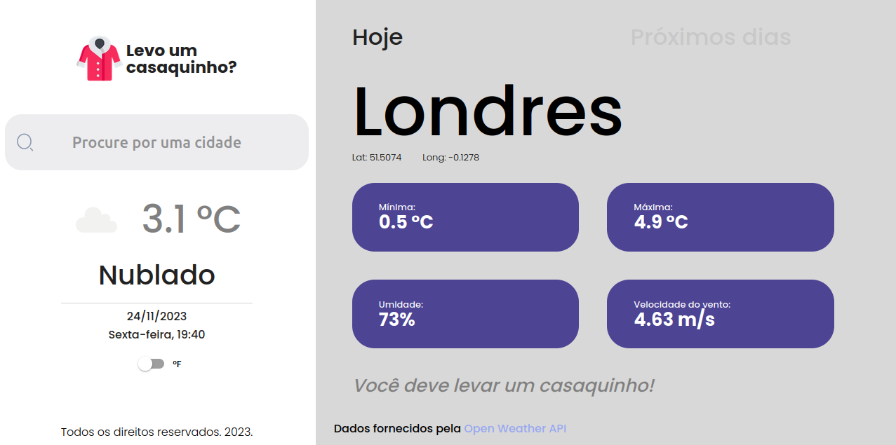

# Levo um casaquinho?

Aplicação de Front-end para o desafio técnico da Driven. Nesta aplicação podemos conferir detalhes sobre o clima em uma localidade qualquer:

# Demo

[Link do projeto](https://projeto25-leve-um-casaquinho.vercel.app/ "Deploy on Vercell:")

# Como funciona?

Ao entrar na plataforma o usuario a verá preenchida com dados mockados e poderá em seguida:

- Preencher uma cidade no componente com a lupa pesquisá-la clicando na lupa ou em enter ao digitar
- Visualizar as opções `hoje` e `pŕoximos dias` clicando sobre elas, para dados mockados ou após buscar dados reais
- Alterar as opções de visualização de unidades de temperatura

# Tecnologias e Bibliotecas utilizadas

- @emotion/react: Versão 11.11.1,
- @emotion/styled: Versão 11.11.0,
- @mui/material: Versão 5.14.18,
- @mui/styled-engine-sc: Versão 6.0.0-alpha.6,
- axios: Versão 1.6.2,
- dayjs: Versão 1.11.10,
- dotenv: Versão 16.3.1,
- react: Versão 18.2.0,
- react-dom: Versão 18.2.0,
- react-router-dom: Versão 6.20.0,
- recharts: Versão 2.10.1,
- styled-components: Versão 6.1.1,
- sweetalert2: Versão 11.10.1

# Como rodar em desenvolvimento

Para rodar Localmente é necessario realizar o comando `npm i` após baixar os conteúdos do repositorio, em seguida criar um arquivo `.env` similar ao de exemplo com dados válidos, finalmente utilize o comando `npm run dev`
